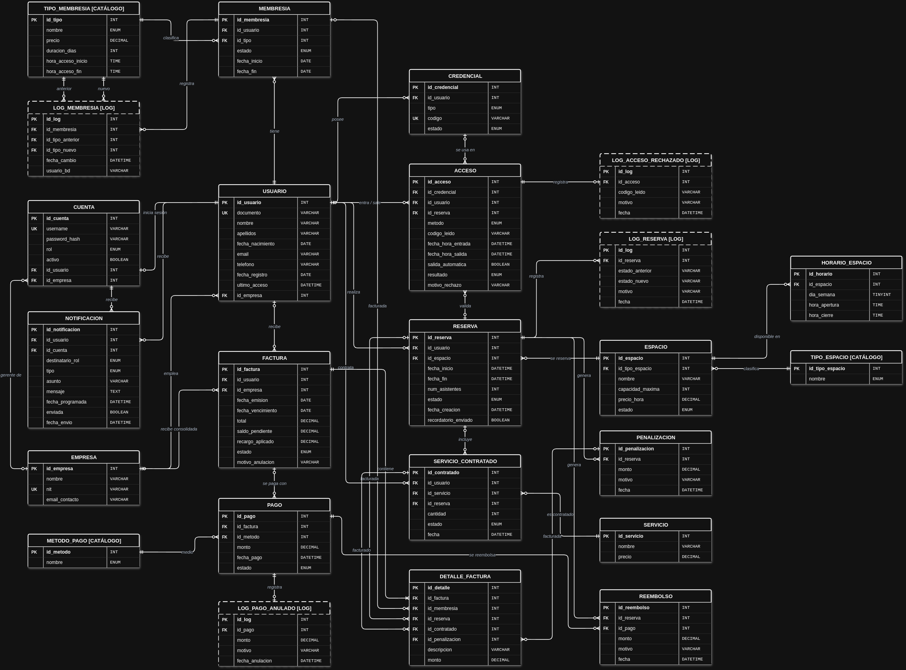

# Gestión de Coworking y Oficinas Compartidas

Base de datos en **MySQL 8** para administrar la operación completa de un espacio de coworking: clientes y empresas, membresías, reservas de espacios, servicios adicionales, facturación y pagos, control de acceso con tarjeta RFID o código QR, notificaciones automáticas y seguridad por roles.

> Grupo 01 · Campuslands

---

## Tabla de contenido

1. [Descripción del proyecto](#descripción-del-proyecto)
2. [Requisitos del sistema](#requisitos-del-sistema)
3. [Estructura del repositorio](#estructura-del-repositorio)
4. [Instalación y configuración](#instalación-y-configuración)
5. [Estructura de la base de datos](#estructura-de-la-base-de-datos)
6. [Ejemplos de consultas](#ejemplos-de-consultas)
7. [Funciones, triggers, procedimientos y eventos](#funciones-triggers-procedimientos-y-eventos)
8. [Roles de usuario y permisos](#roles-de-usuario-y-permisos)

---

## Descripción del proyecto

El sistema modela el día a día de un coworking moderno siguiendo el ciclo de vida de un cliente:

1. **Registro:** el cliente se registra como independiente o como empleado de una empresa, y recibe una cuenta con su rol.
2. **Membresía:** compra una membresía (Diaria, Mensual, Corporativa o Premium). Se factura y, al pagarse, queda **Activa**.
3. **Credencial:** recibe una credencial **RFID o QR**. Cada ingreso se valida contra su membresía, su horario permitido o una reserva confirmada, y queda registrado como asistencia.
4. **Reservas:** reserva escritorios, oficinas privadas, salas de reuniones o salas de eventos, y puede agregar servicios adicionales (proyector, impresiones, café, locker…).
5. **Cobro:** todo lo que se cobra pasa por **factura + detalle_factura**. Hay pagos parciales, facturas consolidadas por empresa, recargos por mora, reembolsos por cancelación y penalizaciones por *No Show*.
6. **Automatización:** triggers y eventos programados mantienen los estados al día (vencimientos, suspensiones, bloqueos), generan recordatorios y entregan reportes al administrador, a recepción y al contador.

### Componentes del proyecto

| Componente | Cantidad | Ubicación |
|---|---|---|
| Tablas | 24 | `sql/00_ddl/01_estructura.sql` |
| Datos de prueba | 100 clientes y el resto de tablas en proporción (≈ 5 500 registros) | `sql/01_dml/01_datos_iniciales.sql` |
| Consultas | 100, en 5 archivos de 20 | `sql/consultas/` |
| Funciones | 20 | `sql/funciones/01_funciones.sql` |
| Triggers | 20, en 4 archivos (uno por módulo) | `sql/triggers/` |
| Procedimientos almacenados | 20 | `sql/procedimientos/01_procedimientos.sql` |
| Eventos | 20 | `sql/eventos/01_eventos.sql` |
| Roles, permisos y usuarios | 5 roles | `sql/seguridad/` |
| Modelo lógico y matriz de permisos | — | `docs/` |

---

## Requisitos del sistema

| Software | Versión | Uso |
|---|---|---|
| **MySQL Server** | 8.0.16 o superior | Motor de base de datos. Se requiere MySQL 8 por el uso de `CHECK`, `DEFAULT (expresión)`, CTE recursivas, funciones de ventana, `JSON_TABLE` y roles. |
| MySQL Workbench o cliente `mysql` | 8.0 | Ejecutar los scripts y las consultas. |

Consideraciones:

- **Usuario administrador:** los scripts deben ejecutarse con un usuario con privilegios de administración (por ejemplo `root`), porque crean la base de datos, rutinas, eventos, roles y usuarios.
- **Codificación UTF-8:** los archivos están en UTF-8 (tildes, eñes y alias como `AÑO`). Desde la terminal hay que usar `--default-character-set=utf8mb4`. Workbench ya trabaja en UTF-8.

---

## Estructura del repositorio

```
coworking-mysql2-grupo01/
├── README.md
├── docs/
│   ├── modelo_logico.drawio.png               # Modelo lógico (diagrama entidad-relación)
│   └── roles_permisos.md                      # Matriz de permisos por rol
└── sql/
    ├── 00_ddl/
    │   └── 01_estructura.sql                  # Creación de la base y las 24 tablas
    ├── 01_dml/
    │   └── 01_datos_iniciales.sql             # Datos de prueba
    ├── consultas/
    │   ├── 01_usuarios_membresias.sql         # Consultas 1 - 20
    │   ├── 02_espacios_reservas.sql           # Consultas 21 - 40
    │   ├── 03_pagos_facturacion.sql           # Consultas 41 - 60
    │   ├── 04_accesos_asistencias.sql         # Consultas 61 - 80
    │   └── 05_consultas_avanzadas.sql         # Consultas 81 - 100
    ├── eventos/
    │   └── 01_eventos.sql                     # Eventos 1 - 20
    ├── funciones/
    │   └── 01_funciones.sql                   # Funciones 1 - 20
    ├── procedimientos/
    │   └── 01_procedimientos.sql              # Procedimientos 1 - 20
    ├── seguridad/
    │   ├── 01_roles.sql                       # Creación de los 5 roles
    │   ├── 02_permisos.sql                    # Permisos, vistas y objetos de apoyo por rol
    │   └── 03_usuarios.sql                    # Usuarios MySQL de ejemplo
    └── triggers/
        ├── 01_triggers_membresias.sql         # Triggers 1 - 5
        ├── 02_triggers_reservas.sql           # Triggers 6 - 10
        ├── 03_triggers_pagos_facturacion.sql  # Triggers 11 - 15
        └── 04_triggers_accesos.sql            # Triggers 16 - 20
```

Todos los archivos SQL tienen la misma cabecera (Proyecto, Grupo, Módulo, Archivo, Descripción y Requisitos), y cada consulta, función, trigger, procedimiento o evento va en su propio bloque numerado con su enunciado.

---

## Instalación y configuración

### 1. Clonar el repositorio

```bash
git clone https://github.com/RickDslayer/coworking-mysql2-grupo01.git
cd coworking-mysql2-grupo01
```

### 2. Ejecutar los scripts en este orden

El orden importa: cada archivo usa objetos creados por los anteriores.

| # | Archivo | Qué hace |
|---|---|---|
| 1 | `sql/00_ddl/01_estructura.sql` | Borra y crea la base `coworking_db` con sus 24 tablas, llaves y restricciones. |
| 2 | `sql/01_dml/01_datos_iniciales.sql` | Carga los datos de prueba. **Debe ir antes de los triggers**, porque los datos ya traen sus estados finales. |
| 3 | `sql/funciones/01_funciones.sql` | Crea las 20 funciones. |
| 4 | `sql/triggers/01_triggers_membresias.sql` | Triggers del módulo Membresías. |
| 5 | `sql/triggers/02_triggers_reservas.sql` | Triggers del módulo Reservas. |
| 6 | `sql/triggers/03_triggers_pagos_facturacion.sql` | Triggers del módulo Pagos y Facturación. |
| 7 | `sql/triggers/04_triggers_accesos.sql` | Triggers del módulo Accesos. |
| 8 | `sql/procedimientos/01_procedimientos.sql` | Crea los 20 procedimientos (se apoyan en los triggers). |
| 9 | `sql/eventos/01_eventos.sql` | Crea los 20 eventos. |
| 10 | `sql/seguridad/01_roles.sql` | Crea los 5 roles. |
| 11 | `sql/seguridad/02_permisos.sql` | Asigna permisos. Necesita que ya existan las funciones y los procedimientos. |
| 12 | `sql/seguridad/03_usuarios.sql` | Crea los usuarios MySQL de ejemplo y les asigna su rol. |

#### Desde la terminal

```bash
mysql -u root -p --default-character-set=utf8mb4 < sql/00_ddl/01_estructura.sql
mysql -u root -p --default-character-set=utf8mb4 < sql/01_dml/01_datos_iniciales.sql
mysql -u root -p --default-character-set=utf8mb4 coworking_db < sql/funciones/01_funciones.sql
mysql -u root -p --default-character-set=utf8mb4 coworking_db < sql/triggers/01_triggers_membresias.sql
mysql -u root -p --default-character-set=utf8mb4 coworking_db < sql/triggers/02_triggers_reservas.sql
mysql -u root -p --default-character-set=utf8mb4 coworking_db < sql/triggers/03_triggers_pagos_facturacion.sql
mysql -u root -p --default-character-set=utf8mb4 coworking_db < sql/triggers/04_triggers_accesos.sql
mysql -u root -p --default-character-set=utf8mb4 coworking_db < sql/procedimientos/01_procedimientos.sql
mysql -u root -p --default-character-set=utf8mb4 coworking_db < sql/eventos/01_eventos.sql
mysql -u root -p --default-character-set=utf8mb4 coworking_db < sql/seguridad/01_roles.sql
mysql -u root -p --default-character-set=utf8mb4 coworking_db < sql/seguridad/02_permisos.sql
mysql -u root -p --default-character-set=utf8mb4 coworking_db < sql/seguridad/03_usuarios.sql
```

#### Desde MySQL Workbench

Abrir cada archivo en el orden de la tabla con **File → Open SQL Script** y ejecutarlo completo con el rayo ⚡ (*Execute*). Los archivos de funciones, triggers, procedimientos y eventos ya traen su `DELIMITER $$`.

Los scripts se pueden volver a ejecutar: el DDL borra y recrea la base, y los demás eliminan cada objeto (`DROP ... IF EXISTS`) antes de crearlo.

### 3. Ejecutar las consultas

Las 100 consultas están en 5 archivos de 20, uno por módulo:

```bash
mysql -u root -p --default-character-set=utf8mb4 coworking_db < sql/consultas/01_usuarios_membresias.sql
mysql -u root -p --default-character-set=utf8mb4 coworking_db < sql/consultas/02_espacios_reservas.sql
mysql -u root -p --default-character-set=utf8mb4 coworking_db < sql/consultas/03_pagos_facturacion.sql
mysql -u root -p --default-character-set=utf8mb4 coworking_db < sql/consultas/04_accesos_asistencias.sql
mysql -u root -p --default-character-set=utf8mb4 coworking_db < sql/consultas/05_consultas_avanzadas.sql
```

O abrir el archivo en Workbench y ejecutar cada consulta por separado (Ctrl + Enter sobre la consulta).

> **Fecha de referencia:** los datos de prueba tienen fechas fijas, con corte al **30/09/2026** y reservas futuras hasta mediados de octubre de 2026. Las consultas que dependen de "hoy" (accesos de hoy, membresías que vencen en 7 días, registros del último mes…) usan la variable `@hoy`, definida al inicio de cada archivo con `SET @hoy = DATE('2026-09-30');`. Así siempre devuelven resultados, sin importar el día en que se ejecuten. La variable vive solo en la sesión: si se ejecuta una consulta suelta en una conexión nueva, hay que ejecutar antes ese `SET`.

---

## Estructura de la base de datos



### Tablas por módulo

#### Usuarios y seguridad

| Tabla | Propósito |
|---|---|
| `empresa` | Empresas a las que pertenecen los clientes corporativos. |
| `usuario` | Clientes del coworking. Los datos de contacto que no se envían quedan en `'N/A'`; `id_empresa` es NULL si el cliente es independiente. |
| `cuenta` | Acceso al sistema: usuario, contraseña y rol. Para un gerente guarda la empresa que administra. |

#### Membresías

| Tabla | Propósito |
|---|---|
| `tipo_membresia` | Catálogo: Diaria, Mensual, Corporativa y Premium, con precio, duración y horario de acceso permitido. |
| `membresia` | Membresías de cada cliente. Cada renovación es una fila nueva, así queda el historial completo. |
| `log_membresia` | Historial de cambios de tipo de membresía. |

#### Espacios y reservas

| Tabla | Propósito |
|---|---|
| `tipo_espacio` | Catálogo: escritorio flexible, oficina privada, sala de reuniones y sala de eventos. |
| `espacio` | Espacios físicos con capacidad, precio por hora y estado (disponible o en mantenimiento). |
| `horario_espacio` | Horario de apertura de cada espacio por día de la semana. |
| `reserva` | Reservas de espacios con su ciclo de estados: Pendiente de Confirmación → Confirmada → Finalizada / No Show / Liberada / Cancelada. |
| `log_reserva` | Historial de cambios de estado de las reservas. |

#### Servicios adicionales

| Tabla | Propósito |
|---|---|
| `servicio` | Catálogo: internet premium, locker, café ilimitado, impresiones, proyector y estacionamiento. |
| `servicio_contratado` | Servicios que contrata cada cliente: sueltos (mensuales) o dentro de una reserva. |

#### Pagos y facturación

| Tabla | Propósito |
|---|---|
| `metodo_pago` | Catálogo: Efectivo, Tarjeta, Transferencia y PayPal. |
| `factura` | Facturas individuales o consolidadas por empresa, con saldo pendiente, recargo y estado. |
| `detalle_factura` | Líneas de cada factura. Cada línea cobra **una** cosa: membresía, reserva, servicio o penalización. |
| `pago` | Pagos de cada factura (una factura puede tener varios pagos parciales). |
| `log_pago_anulado` | Registro de los pagos anulados y su motivo. |
| `reembolso` | Devoluciones por reservas canceladas que ya estaban pagadas. |
| `penalizacion` | Cargos por *No Show*. |

#### Accesos

| Tabla | Propósito |
|---|---|
| `credencial` | Tarjetas RFID y códigos QR de cada cliente. |
| `acceso` | Cada intento de ingreso. Si es permitido, esa fila **es la asistencia** (entrada y salida). |
| `log_acceso_rechazado` | Registro de los intentos de acceso rechazados y su motivo. |

#### Comunicación

| Tabla | Propósito |
|---|---|
| `notificacion` | Recordatorios, alertas y reportes que generan los eventos, dirigidos a un cliente, a una cuenta del personal o a un rol. |

### Cómo se relacionan

- **`usuario` es el centro:** de él dependen sus membresías, reservas, servicios, credenciales, accesos y facturas.
- **Todo lo que se cobra pasa por `factura` → `detalle_factura`:** cada línea apunta a la membresía, reserva, servicio o penalización que cobra. Los `pago` se registran contra la factura.
- **`acceso` se liga a la `reserva`:** cuando el cliente entra para usarla, así se sabe qué reservas se usaron de verdad y cuáles no (*No Show*).
- **Las tablas `log_*` las llenan los triggers:** sirven de auditoría.

### Datos de prueba

`sql/01_dml/01_datos_iniciales.sql` carga 100 clientes (60 corporativos en 10 empresas y 40 independientes) y el resto de tablas en proporción, coherentes entre sí: los totales de cada factura cuadran con su detalle, los saldos con los pagos y los accesos con membresías vigentes. Incluye a propósito los casos que buscan las consultas: reservas que exceden la capacidad o se solapan, pagos tardíos y parciales, accesos rechazados por QR inválido, clientes que solo vienen el fin de semana, etc. Las contraseñas de las cuentas están en texto plano porque son datos de prueba.

| Tabla | Registros | Tabla | Registros |
|---|---|---|---|
| empresa | 10 | metodo_pago | 4 |
| usuario | 100 | factura | 544 |
| cuenta | 104 | detalle_factura | 910 |
| tipo_membresia | 4 | pago | 533 |
| membresia | 461 | log_pago_anulado | 8 |
| log_membresia | 26 | reembolso | 16 |
| tipo_espacio | 4 | penalizacion | 17 |
| espacio | 15 | credencial | 125 |
| horario_espacio | 98 | acceso | 1 044 |
| reserva | 256 | log_acceso_rechazado | 38 |
| log_reserva | 457 | notificacion | 265 |
| servicio | 6 | servicio_contratado | 200 |

### Reglas de negocio principales

| Concepto | Regla |
|---|---|
| Membresías | Diaria $15 (1 día, 07:00–19:00) · Mensual $180 (30 días, 07:00–21:00) · Corporativa $150 (30 días, 06:00–22:00) · Premium $300 (30 días, 24 h). |
| Espacios | Escritorio $5/h · Oficina privada $20/h · Sala de reuniones $25/h · Sala de eventos $80/h. |
| Horario de espacios | Lunes a viernes 07:00–21:00 · sábado 08:00–14:00 · domingo 09:00–13:00 (solo escritorios y salas de eventos). |
| Plazos de pago | Membresía diaria: el mismo día · mensual: 5 días · reserva: 3 días · penalización: 5 días · factura consolidada: 10 días. |
| Mora | Recordatorio cada 3 días · servicios bloqueados a los 10 días · recargo a los 15 días · membresía suspendida. |
| No Show | Penalización sobre el valor de la reserva. |
| Cancelación | Reembolso parcial si la reserva ya estaba pagada. |
| Facturación corporativa | Las empresas 1 a 5 reciben una factura consolidada mensual; las demás se facturan por empleado. |

---

## Ejemplos de consultas

Las 100 consultas están en `sql/consultas/`, una por módulo:

| Archivo | Módulo | Consultas |
|---|---|---|
| `01_usuarios_membresias.sql` | Usuarios y Membresías | 1 – 20 |
| `02_espacios_reservas.sql` | Espacios y Reservas | 21 – 40 |
| `03_pagos_facturacion.sql` | Pagos y Facturación | 41 – 60 |
| `04_accesos_asistencias.sql` | Accesos y Asistencias | 61 – 80 |
| `05_consultas_avanzadas.sql` | Consultas Avanzadas (subconsultas, múltiples JOIN, agregaciones y funciones de ventana) | 81 – 100 |

### Básicas

**Consulta 18. Usuarios cuya membresía vence en los próximos 7 días**: lista a quién hay que recordarle la renovación.

```sql
SELECT
    u.id_usuario,
    u.nombre,
    m.fecha_fin,
    DATEDIFF(m.fecha_fin, @hoy) AS dias_restantes
FROM membresia AS m
INNER JOIN usuario AS u
    ON u.id_usuario = m.id_usuario
WHERE m.estado = 'activa'
  AND m.fecha_fin BETWEEN @hoy AND DATE_ADD(@hoy, INTERVAL 7 DAY)
ORDER BY m.fecha_fin;
```

**Consulta 28. Reservas que exceden la capacidad del espacio**: detecta reservas con más asistentes de los permitidos.

```sql
SELECT r.id_reserva,
       e.nombre AS espacio,
       r.fecha_inicio,
       r.num_asistentes,
       e.capacidad_maxima,
       r.num_asistentes - e.capacidad_maxima AS exceso
FROM reserva r
JOIN espacio e ON e.id_espacio = r.id_espacio
WHERE r.num_asistentes > e.capacidad_maxima;
```

### Avanzadas

**Consulta 81. Usuarios con el mayor gasto acumulado (subconsulta con SUM)**: para cada usuario suma lo que ha pagado y muestra los 10 que más han gastado.

```sql
SELECT u.id_usuario, u.nombre, u.apellidos,
       (SELECT IFNULL(SUM(p.monto), 0)
        FROM pago p
        JOIN factura f ON p.id_factura = f.id_factura
        WHERE f.id_usuario = u.id_usuario
          AND p.estado = 'Pagado') AS gasto_total
FROM usuario u
ORDER BY gasto_total DESC
LIMIT 10;
```

**Consulta 85. Empresas cuyos empleados generan más del 20% de los ingresos**: suma lo pagado en las facturas consolidadas de cada empresa y en las individuales de sus empleados, y lo compara con el total de ingresos.

```sql
SELECT e.id_empresa, e.nombre, SUM(p.monto) AS ingresos_empresa
FROM pago p
JOIN factura f ON p.id_factura = f.id_factura
LEFT JOIN usuario u ON f.id_usuario = u.id_usuario
JOIN empresa e ON e.id_empresa = IFNULL(f.id_empresa, u.id_empresa)
WHERE p.estado = 'Pagado'
GROUP BY e.id_empresa, e.nombre
HAVING SUM(p.monto) > 0.20 * (SELECT SUM(monto) FROM pago WHERE estado = 'Pagado');
```

Otras técnicas usadas en las consultas: subconsultas correlacionadas, CTE recursivas para calcular horas disponibles y tasas de ocupación (consultas 30 y 88), funciones de ventana con `OVER` (consulta 99) y múltiples JOIN con tablas derivadas (consulta 100).

---

## Funciones, triggers, procedimientos y eventos

### Funciones (20) · `sql/funciones/01_funciones.sql`

| Módulo | Funciones |
|---|---|
| Membresías (1–5) | `fn_membresia_activa`, `fn_dias_restantes_membresia`, `fn_tipo_membresia`, `fn_renovaciones_membresia`, `fn_estado_membresia` |
| Reservas (6–10) | `fn_total_reservas`, `fn_horas_reservadas`, `fn_espacio_mas_reservado`, `fn_reservas_activas`, `fn_duracion_promedio_reservas` |
| Pagos y Facturación (11–15) | `fn_total_pagado`, `fn_ingresos_por_mes`, `fn_ingresos_por_membresias`, `fn_ingresos_por_reservas`, `fn_ingresos_por_empresa` |
| Accesos y Asistencias (16–20) | `fn_total_asistencias`, `fn_asistencias_mes`, `fn_top_usuario_asistencias`, `fn_ultima_asistencia`, `fn_promedio_asistencias` |

```sql
-- Tipo de membresía y días restantes del cliente 1
SELECT fn_tipo_membresia(1), fn_dias_restantes_membresia(1);

-- Horas reservadas por el cliente 1 en septiembre de 2026
SELECT fn_horas_reservadas(1, 9, 2026);

-- Ingresos de septiembre de 2026 y ranking de empresas por ingresos
SELECT fn_ingresos_por_mes(9, 2026);
SELECT nombre, fn_ingresos_por_empresa(id_empresa) AS ingresos
FROM empresa ORDER BY ingresos DESC;

-- Espacio más reservado y usuario con más asistencias
SELECT fn_espacio_mas_reservado(), fn_top_usuario_asistencias();
```

### Triggers (20) · `sql/triggers/`

| # | Archivo | Qué hace |
|---|---|---|
| 1 | `01_triggers_membresias.sql` | Inserta la fecha de vencimiento automáticamente al crear una membresía. |
| 2 | | Actualiza la membresía a "Activa" cuando se realiza un pago exitoso (su factura queda pagada). |
| 3 | | Actualiza la membresía a "Suspendida" cuando su factura vence sin pagarse. |
| 4 | | Registra en `log_membresia` cada cambio de tipo de membresía. |
| 5 | | Bloquea la eliminación de una membresía si el usuario tiene reservas activas. |
| 6 | `02_triggers_reservas.sql` | Impide reservas duplicadas en el mismo espacio, fecha y hora. |
| 7 | | Registra automáticamente el estado "Pendiente de Confirmación" al crear una reserva. |
| 8 | | Cambia la reserva a "Confirmada" al registrar su pago. |
| 9 | | Cancela las reservas del usuario si elimina su membresía. |
| 10 | | Registra en `log_reserva` cada reserva cancelada. |
| 11 | `03_triggers_pagos_facturacion.sql` | Crea automáticamente una factura al registrar un pago. |
| 12 | | Actualiza la factura a "Pagada" cuando se confirma el pago (recalcula saldo y estado). |
| 13 | | Bloquea la eliminación de un pago que ya tiene factura asociada. |
| 14 | | Actualiza el saldo pendiente de la factura con cada pago parcial. |
| 15 | | Registra en `log_pago_anulado` los pagos anulados. |
| 16 | `04_triggers_accesos.sql` | Registra la asistencia al validar el acceso con QR o tarjeta. |
| 17 | | Rechaza el acceso si no hay credencial válida, membresía activa o reserva en curso, o si es fuera de horario. |
| 18 | | Actualiza la última fecha de acceso del usuario. |
| 19 | | Registra la salida automáticamente si el usuario vuelve a entrar sin salida previa. |
| 20 | | Registra en `log_acceso_rechazado` cada intento de acceso rechazado. |

> **Nota sobre el trigger 19:** MySQL no permite que un trigger modifique la misma tabla que lo disparó (error 1442). Esta regla obligaría a actualizar una fila de `acceso` mientras se inserta otra en `acceso`, así que la lógica se implementa en el procedimiento que registra la entrada del usuario (procedimiento 14).

```sql
-- Un QR inexistente queda rechazado y registrado en el log
INSERT INTO acceso (metodo, codigo_leido) VALUES ('QR', 'QR-no-existe');
SELECT resultado, motivo_rechazo FROM acceso ORDER BY id_acceso DESC LIMIT 1;
SELECT * FROM log_acceso_rechazado ORDER BY id_log DESC LIMIT 1;
```

### Procedimientos almacenados (20) · `sql/procedimientos/01_procedimientos.sql`

| Módulo | # | Qué hace |
|---|---|---|
| Membresías | 1 | Registra una nueva membresía y la asigna a un usuario. |
| | 2 | Renueva una membresía existente según el tipo contratado. |
| | 3 | Marca como "Vencida" las membresías que superaron su fecha de fin. |
| | 4 | Suspende membresías con facturas impagas por más de X días. |
| Reservas y Espacios | 5 | Verifica la disponibilidad de un espacio (sin solapamiento de horarios). |
| | 6 | Crea una nueva reserva en estado "Pendiente" y la vincula al usuario y al espacio. |
| | 7 | Confirma la reserva al registrar el pago. |
| | 8 | Cancela una reserva con opción de reembolso parcial. |
| | 9 | Libera (cancela) reservas no confirmadas después de X horas. |
| Pagos y Facturación | 10 | Genera la factura de una membresía al activarla o renovarla. |
| | 11 | Genera una factura consolidada con los cargos de los empleados de una empresa. |
| | 12 | Aplica recargos a facturas con más de X días de atraso. |
| | 13 | Bloquea los servicios adicionales de clientes con facturas pendientes. |
| Accesos y Asistencias | 14 | Registra la entrada del usuario: valida membresía o reserva activa y cierra los ingresos anteriores sin salida. |
| | 15 | Registra la salida del usuario y completa su asistencia. |
| | 16 | Genera el reporte diario de asistencias: ingresos, usuarios únicos y horarios pico. |
| | 17 | Marca reservas confirmadas sin asistencia como "No Show" y genera la penalización. |
| Corporativos y Administración | 18 | Registra un lote de empleados de una empresa y les asigna membresía corporativa. |
| | 19 | Cancela las reservas futuras de un usuario al eliminar su membresía. |
| | 20 | Genera el reporte de ingresos mensuales y el acumulado del año. |

```sql
-- Crear una reserva y confirmarla con su pago
CALL sp_crear_reserva(1, 11, '2026-10-20 10:00', '2026-10-20 12:00', 4, @id_reserva);
CALL sp_confirmar_reserva_con_pago(@id_reserva, 2, 50.00, @id_pago);

-- Factura consolidada de la empresa 1 para octubre de 2026
CALL sp_factura_consolidada(1, 10, 2026, @id_factura);

-- Recargo del 10% a facturas con más de 15 días de atraso
CALL sp_aplicar_recargos_vencidas(15, 10);

-- Reporte de asistencias del 30 de septiembre de 2026
CALL sp_reporte_asistencias_diario('2026-09-30');
```

### Eventos (20) · `sql/eventos/01_eventos.sql`

| Módulo | Eventos | Frecuencia |
|---|---|---|
| Membresías (1–5) | Vencer membresías · recordatorio de renovación 5 días antes · suspender membresías sin pago después de 30 días · reporte semanal de nuevas membresías · aviso diario de membresías suspendidas a recepción | Diaria / semanal |
| Reservas (6–10) | Cancelar reservas no confirmadas después de 2 h · recordatorio 1 h antes de la reserva · eliminar reservas no asistidas después de 7 días · reporte semanal de ocupación · liberar reservas no iniciadas a los 15 min | Cada pocos minutos / diaria / semanal |
| Pagos y Facturación (11–15) | Recordatorio de pago pendiente cada 3 días · bloquear servicios con facturas vencidas de más de 10 días · resumen de facturación mensual · recargos a facturas vencidas de más de 15 días · reporte de ingresos acumulados al contador a fin de mes | Diaria / cada 3 días / mensual |
| Accesos y Asistencias (16–20) | Eliminar accesos de más de 1 año · reporte diario de asistencias · reporte semanal de usuarios inactivos · alerta diaria de accesos fuera de horario · top 10 de usuarios más frecuentes cada mes | Diaria / semanal / mensual |

Los avisos y reportes se guardan en la tabla `notificacion`, dirigidos al cliente, al administrador, al contador, al gerente o a recepción.

```sql
SELECT EVENT_NAME, STATUS, INTERVAL_VALUE, INTERVAL_FIELD
FROM information_schema.EVENTS
WHERE EVENT_SCHEMA = 'coworking_db';
```

### Objetos de apoyo (no forman parte de los 20 del enunciado)

Están en `sql/seguridad/02_permisos.sql` y sirven para limitar lo que ve cada cliente y cada gerente:

| Objeto | Para qué sirve |
|---|---|
| `fn_usuario_actual()` | Devuelve el cliente conectado; filtra las vistas del rol Usuario. |
| `fn_empresa_gerente()` | Devuelve la empresa del gerente conectado; filtra las vistas del rol Gerente. |
| `sp_crear_cuenta_empleado` | El gerente crea la cuenta de un empleado de su empresa (siempre con rol Usuario). |
| `sp_estado_cuenta_empleado` | El gerente activa o desactiva la cuenta de un empleado de su empresa. |

---

## Roles de usuario y permisos

| Rol | Nombre en MySQL | Permisos |
|---|---|---|
| **Administrador** | `rol_administrador` | Acceso total a la base (`ALL PRIVILEGES`): tablas, rutinas, triggers y eventos. |
| **Recepcionista** | `rol_recepcionista` | Registra clientes, empresas, cuentas, membresías, credenciales, reservas, servicios y accesos. Crea facturas y registra pagos, pero no los modifica. Ejecuta las funciones de membresías, reservas y asistencias y los procedimientos de su área. |
| **Usuario** (cliente) | `rol_usuario` | Solo ve **sus propios** datos mediante vistas: perfil, membresías, reservas, facturas, pagos y accesos. Puede actualizar su email, teléfono y contraseña, crear y cancelar sus reservas y contratar servicios. |
| **Gerente Corporativo** | `rol_gerente` | Solo ve los datos de **su empresa** mediante vistas: empleados, sus membresías, reservas y accesos, y la facturación consolidada. Registra empleados y administra sus cuentas. |
| **Contador** | `rol_contador` | Gestiona el módulo financiero: facturas, detalles, pagos, reembolsos, penalizaciones y recargos. Consulta membresías, reservas y servicios para cruzar ingresos. No ve contraseñas ni accesos físicos. |

La matriz completa de permisos está en `docs/roles_permisos.md`, y su implementación en `sql/seguridad/`:

| Archivo | Contenido |
|---|---|
| `01_roles.sql` | Crea los 5 roles. |
| `02_permisos.sql` | Por cada rol: permisos sobre tablas, vistas, funciones y procedimientos, más los objetos de apoyo. |
| `03_usuarios.sql` | Crea un usuario de ejemplo por rol, le asigna el rol y lo deja activo al iniciar sesión. |

### Cómo se limita lo que ve cada cliente y cada gerente

`GRANT` da permisos sobre tablas completas, no sobre filas. Por eso los roles Usuario y Gerente **no reciben permisos sobre las tablas** con datos de clientes, sino sobre **vistas** (`v_mis_reservas`, `v_mis_facturas`, `v_empleados`, `v_facturas_empresa`…) que filtran por la persona conectada. Para que funcione, **cada usuario MySQL debe llamarse igual que su registro en `cuenta.username`**.

Además:

- **Logs protegidos:** las tablas `log_*` solo las escriben los triggers, así nadie puede alterar la auditoría.
- **Validación en procedimientos:** los procedimientos que puede ejecutar un cliente (crear y cancelar reservas) validan que la reserva sea suya, y el del gerente valida que sea su empresa.

### Usuarios de ejemplo (`sql/seguridad/03_usuarios.sql`)

| Usuario | Contraseña | Rol |
|---|---|---|
| `admin` | `Admin2914#` | Administrador |
| `recepcion1` | `Recepcion16102#` | Recepcionista |
| `recepcion2` | `Recepcion24137#` | Recepcionista |
| `miguel.ramirez1` | `Miguel4805!` | Usuario (cliente independiente) |
| `carlos.munoz2` | `Carlos4292#` | Gerente Corporativo (Andes Software SAS) |
| `contador` | `Contador5620*` | Contador |

### Crear un usuario nuevo y asignarle un rol

```sql
-- 1. Registrar al cliente y su cuenta (el username debe ser igual al usuario MySQL)
INSERT INTO usuario (documento, nombre, apellidos, fecha_nacimiento)
VALUES ('1098765432', 'Nuevo', 'Usuario', '1995-05-10');
INSERT INTO cuenta (username, password_hash, rol, id_usuario)
VALUES ('nuevo.usuario', 'Clave123*', 'Usuario', LAST_INSERT_ID());

-- 2. Crear el usuario MySQL
CREATE USER 'nuevo.usuario'@'localhost' IDENTIFIED BY 'Clave123*';

-- 3. Asignarle el rol y activarlo al iniciar sesión
GRANT 'rol_usuario' TO 'nuevo.usuario'@'localhost';
SET DEFAULT ROLE 'rol_usuario' TO 'nuevo.usuario'@'localhost';
```

### Probar los permisos

```bash
mysql -u miguel.ramirez1 -p coworking_db
```

```sql
SELECT * FROM v_mis_reservas;   -- solo sus reservas
SELECT * FROM reserva;          -- ERROR 1142: sin permiso sobre la tabla
SHOW GRANTS FOR 'rol_usuario';  -- (como root) ver los permisos del rol
```
